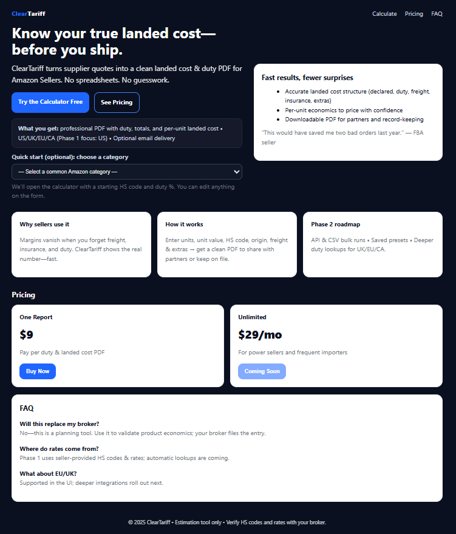
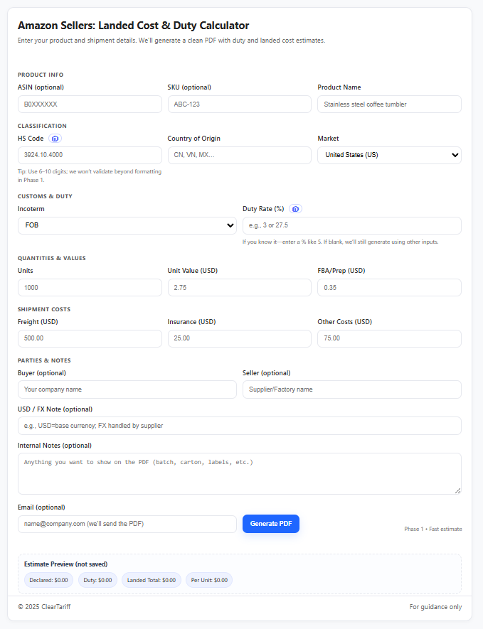
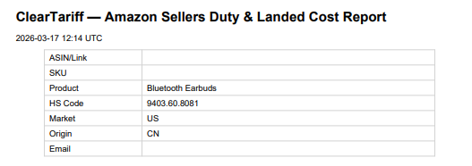
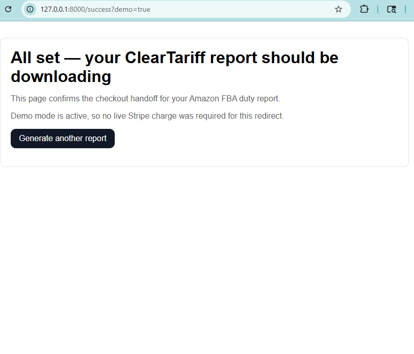
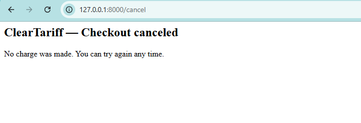

# ClearTariff Landed Cost Calculator

ClearTariff is a FastAPI demonstration project for estimating landed cost, generating a PDF report, and routing a user through a checkout-ready workflow. It is structured as a compact portfolio-grade service that shows how a lightweight Python web application can combine form handling, calculation logic, document generation, payment integration, and operational health monitoring.

## Features

- Browser-based landed-cost calculator for Amazon seller style workflows
- Duty, freight, insurance, prep, and other cost inputs in a single report flow
- PDF report generation for shareable output
- Multiple PDF rendering strategies with fallback behavior
- Stripe Checkout session endpoint for paywalled or demo-mode flows
- Success and cancel pages for end-to-end checkout demonstration
- Optional email or local outbox delivery path for generated reports
- Health endpoint for uptime checks and platform probes
- Lightweight automated route tests for key user-facing pages

## Screenshots











## Demo Flow

1. A user lands on the marketing page or calculator form.
2. The browser submits shipment, product, and cost inputs to the FastAPI service.
3. The service assembles a landed-cost payload from the submitted fields.
4. The PDF layer generates a report using the preferred renderer and falls back if needed.
5. If the report is part of a paid flow, the frontend can call Stripe Checkout session creation.
6. Stripe redirects the user to the success or cancel page after checkout.
7. The service can optionally email the generated PDF or write an outbox copy for local demos.

## Architecture Diagram (ASCII)

```text
┌────────────────────┐
│ Browser / Recruiter│
└─────────┬──────────┘
                    │ HTTP
                    v
┌─────────────────────────────────────────────┐
│ FastAPI Application                         │
│ app/main.py + app/routes/*                  │
└───────┬─────────────────┬───────────────────┘
                │                 │
                │                 ├───────────────────────────────┐
                │                 │                               │
                v                 v                               v
┌───────────────┐  ┌──────────────────┐         ┌──────────────────┐
│ HTML Templates│  │ Landed-Cost Flow │         │ Stripe Checkout  │
│ app/templates │  │ form -> payload  │         │ create-session   │
└───────┬───────┘  └────────┬─────────┘         └────────┬─────────┘
                │                   │                            │
                v                   v                            v
┌───────────────┐  ┌──────────────────┐         ┌──────────────────┐
│ Success/Cancel│  │ PDF Renderers    │         │ Success / Cancel │
│ Pages         │  │ ReportLab/Weasy  │         │ Redirect Targets │
└───────────────┘  └────────┬─────────┘         └──────────────────┘
                                                        │
                                                        v
                                     ┌────────────────────┐
                                     │ Email / Outbox     │
                                     │ Optional delivery  │
                                     └────────────────────┘

Operational endpoint: GET /__health
```

## Project Structure

```text
.
|-- app/
|   |-- main.py                  # FastAPI bootstrap, form handler, PDF orchestration, health endpoint
|   |-- data/
|   |   `-- providers.py         # Optional tariff/rate provider integrations
|   |-- pdf/
|   |   |-- reportlab_fallback.py
|   |   |-- reportlab_report.py
|   |   |-- reportlab_report_amazon.py
|   |   `-- weasy_report.py      # Optional alternate PDF renderer
|   |-- presets/                 # Sample product presets
|   |-- routes/                  # Page, checkout, success, and webhook route modules
|   |-- static/                  # Static assets and sample downloads
|   |-- templates/               # Landing page, form, pricing, success, and cancel views
|   `-- utils/                   # Email and order logging utilities
|-- docs/
|   `-- screenshots/             # README images
|-- outbox/                      # Local report/email fallback output
|-- tests/                       # Automated route tests and manual smoke scripts
|-- Dockerfile                   # Container packaging
|-- requirements.txt             # Core Python dependencies
|-- requirements-weasy.txt       # Optional WeasyPrint dependency set
`-- SYSTEM_OVERVIEW.md           # Concise architecture walkthrough
```

## Tech Stack

- Python
- FastAPI
- Uvicorn
- Jinja2 templates
- Stripe Python SDK
- ReportLab
- WeasyPrint as an optional renderer
- python-dotenv
- Resend for optional email delivery
- Pytest with FastAPI TestClient
- Docker

## Engineering Concepts Demonstrated

- Service composition in a small FastAPI codebase
- Separation of concerns between routing, templates, PDF rendering, and utilities
- Environment-driven deployment behavior for local and hosted execution
- Graceful degradation through renderer fallback and outbox fallback patterns
- Payment integration using Stripe Checkout session creation and webhooks
- Document generation from structured business inputs
- Operational readiness with a health probe endpoint
- Testable HTTP surface with lightweight route coverage

## Local Development

```bash
python -m venv .venv
.venv\Scripts\activate
pip install -r requirements.txt
uvicorn app.main:app --reload
```

The application runs locally at http://127.0.0.1:8000.

### Health Check

`GET /__health` returns a small JSON response such as `{"ok": true, "status": "healthy"}`. It is intended for uptime monitoring, deployment platform probes, and simple operational verification.

## Environment Variables

The project is driven primarily by environment configuration. The most relevant variables are:

| Variable | Purpose |
| --- | --- |
| `APP_URL` | Base application URL used to construct redirects |
| `SUCCESS_URL` | Checkout success redirect target |
| `CANCEL_URL` | Checkout cancel redirect target |
| `ENABLE_PAYWALL` | Enables the purchase gate for report generation or checkout flow |
| `PAYWALL_ENABLED` | Alternate paywall flag recognized by the app |
| `STRIPE_SECRET_KEY` | Server-side Stripe API key |
| `STRIPE_PRICE_ID` | Stripe Price ID used for checkout sessions |
| `STRIPE_API_VERSION` | Optional Stripe API version override |
| `STRIPE_WEBHOOK_SECRET` | Secret used to validate incoming Stripe webhooks |
| `ENABLE_WEASY` | Enables WeasyPrint rendering when installed |
| `PREFER_REPORTLAB` | Keeps ReportLab as the preferred PDF renderer |
| `LOG_LEVEL` | Controls application logging verbosity |
| `RESEND_API_KEY` | Enables outbound email delivery through Resend |
| `EMAIL_SENDER` | From-address for report delivery |
| `EMAIL_SENDER_NAME` | Display name for outbound email |
| `REPLY_TO` | Optional reply-to address |
| `EMAIL_CC` | Optional comma-separated CC list |
| `EMAIL_BCC` | Optional comma-separated BCC list |
| `BRAND_NAME` | Branding name shown in report metadata |
| `BRAND_URL` | Branding website shown in report footer |
| `SHOW_BRAND_FOOTER` | Enables footer branding on generated reports |
| `ORDER_DB_PATH` | SQLite path for order logging |

## Example API Payload

The browser submits `POST /generate` as form data. The logical request values look like this:

```json
{
    "asin": "B0EXAMPLE01",
    "sku": "CT-COFFEE-001",
    "product_name": "Stainless Steel Coffee Tumbler",
    "hs_code": "3924.10.4000",
    "incoterm": "FOB",
    "duty_rate_pct": 7.5,
    "units": 1000,
    "unit_value_usd": 2.75,
    "freight_usd": 500.0,
    "insurance_usd": 25.0,
    "other_costs_usd": 75.0,
    "fba_prep_usd": 0.35,
    "usd_fx_note": "USD settled directly with supplier",
    "notes": "Pilot order for Q4 launch",
    "buyer": "Northwind Commerce",
    "seller": "Shenzhen Sample Manufacturing",
    "country_of_origin": "CN",
    "market": "US",
    "email": "ops@northwind.example"
}
```

## Demonstration Architecture Notes

This repository is intentionally compact, but it demonstrates a complete engineering story that is useful in a recruiter or portfolio review:

- A user-facing web workflow backed by a typed Python service
- Modular route organization instead of a single-file demo app
- Real operational concerns such as health checks, configuration, and third-party integration
- Document generation with fallback strategy rather than a single happy-path implementation
- A checkout-capable architecture that can run both in demo mode and in a payment-enabled deployment

For a concise system walkthrough of the folders and request lifecycle, see SYSTEM_OVERVIEW.md.
